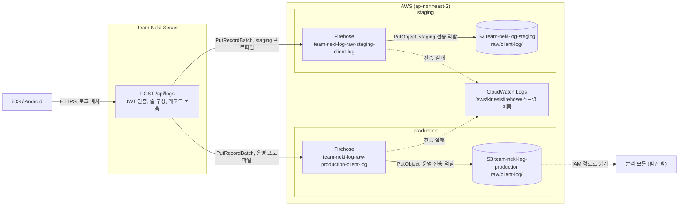

# HLD: Raw

이 문서는 raw 토픽이 앱 클라이언트 로그를 S3 에 적재하는 구조를 다룹니다.

2026-10-05 기준이며, 실제 동작은 코드가 정본입니다 (`raw/infra`, `infra/iam.tf`, Team-Neki-Server 의 `POST /api/logs`). 대안 비교와 비용 계산은 [ADR-0004](../adr/0004-raw-client-log-firehose.md), 리소스 목록과 적용 절차는 [raw/README.md](../../raw/README.md), 진행 상황은 [Roadmap](../plan/roadmap.md) 에 있습니다.

## 0. 요약

- 문제 : iOS·Android 앱 로그를 영구 저장할 곳이 없음
- 구조 : 앱 -> Server `POST /api/logs` -> Firehose 전송 스트림 -> 환경별 버킷의 `raw/client-log/`
- 책임 : 인증과 줄 구성은 Server, 버퍼링과 S3 객체 생성은 Firehose, 스트림·버킷·전송 역할 정의는 이 레포
- 이 레포에 raw 실행 코드는 없음. Terraform 리소스만 있음 (`raw/infra`, `infra`)
- 변경하지 않는 것 : aggregation 의 경로·Lambda·IAM, 운영 버킷 설정
- 핵심 결정 : Firehose Direct PUT, 요청 단위 레코드 묶음, 환경별 버킷 분리, UTC 도착 시각 파티션
- 미결 : 중복 줄을 거르는 위치, 로그 개인정보 규칙, 전송 실패 알림 (§10)

## 1. 배경과 범위

### 1.1 문제

iOS·Android 앱 로그를 영구 저장할 곳이 없었습니다. 분석은 별도 모듈의 책임이므로, raw 토픽은 로그 원본을 잃지 않고 S3 에 쌓는 데까지만 책임집니다.

### 1.2 요구사항

| ID | 요구사항 | 범위 |
|---|---|---|
| R-1 | 인증된 사용자의 앱 로그를 원본 그대로 S3 에 적재 | 포함 |
| R-2 | 서버가 붙이는 사용자·플랫폼·수신 시각을 앱이 덮어쓰지 못함 | 포함 |
| R-3 | Server staging 에서 배포 전 S3 적재까지 검증 | 포함 |
| R-4 | 계정 Budgets 월 $5 안에서 운영 | 포함 |
| R-5 | 로그 스키마 강제 | Spec-out. 로그 원소는 자유 JSON |
| R-6 | 중복 없는 적재 (exactly-once) | Spec-out. at-least-once 이며 중복 처리는 Open Issue |
| R-7 | 실시간 조회·알림·대시보드 | Spec-out |
| R-8 | 분석용 포맷 변환 (Parquet 등) | Spec-out. 스키마가 정해지면 재검토 |

### 1.3 Non-goals

- 로그 분석·조회·시각화 : 별도 모듈 책임
- 앱의 로그 수집·보관·재전송 로직 : 앱 책임
- `POST /api/logs` 구현 : Team-Neki-Server 책임 (BACKEND-166). 이 문서는 이 레포와 맞닿는 계약만 다룸

## 2. 설계를 결정한 제약

raw 는 aggregation 과 같은 운영 버킷을 쓰지만 트래픽과 환경 조건이 다릅니다. 아래 제약이 구조를 정했습니다.

- 트래픽 : aggregation 경로(API Gateway + Lambda)는 일 1회 호출을 전제로 throttling 10 req/s, Reserved Concurrency 2 로 묶여 있습니다. 앱 로그는 사용량에 비례해 하루 내내 들어오므로 이 경로에 얹을 수 없습니다.
- 인증 : 사용자 인증(JWT)은 이미 Server 가 합니다. 앱에 AWS 자격증명을 내리면 Server 가 붙이는 `userId` 를 신뢰할 수 없게 됩니다.
- 과금 단위 : Firehose Direct PUT 은 레코드마다 5KB 단위로 올려 과금합니다. 앱 로그 한 줄은 수백 바이트라서, 로그 1건을 레코드 1건으로 보내면 실제 바이트의 약 12배를 냅니다.
- 비용 한도 : AWS Budgets 월 $5 는 계정 전체 한도입니다 (2026-10 실제 $1.11).
- 권한 경계 : 전송 역할은 자기 버킷의 `raw/` 아래에만 쓰고, 실패 로그는 `/aws/kinesisfirehose/team-neki-log-*` 로그 그룹에만 남길 수 있습니다. 적재 경로와 로그 그룹 이름은 이 범위 안에서 정해야 합니다.
- 환경 : 이 레포는 단일 환경(prod)을 전제하지만, Server 는 staging 에서 배포 전 검증을 합니다. 계정의 다른 서비스(Server 미디어, Workflow)는 환경을 버킷으로 나눕니다.
- 운영 버킷 : `team-neki-log-production` 은 aggregation 데이터와 모든 Terraform state 를 함께 담습니다. raw 쓰기가 `raw/` 밖으로 새면 state 에 닿을 수 있습니다.

## 3. 구조

### 3.1 전체 그림



Server 는 실행 환경에 맞는 스트림 하나에만 씁니다 (`aws.firehose.delivery-stream`). 두 스트림 모두 버퍼 5MiB 또는 300초, GZIP 압축으로 같은 설정입니다. 운영 버킷은 `aggregation/infra`, 스트림·로그 그룹·staging 버킷은 `raw/infra`, 전송 역할은 `infra` 가 만듭니다.

### 3.2 책임 경계

| 책임 | 앱 | Server | Firehose | 이 레포 |
|---|---|---|---|---|
| 로그 생성, 실패 시 재전송 | O | | | |
| 사용자 인증 (JWT) | | O | | |
| 건수·크기 검증 | | O | | |
| `userId`·`platform`·`receivedAt` 부착 | | O | | |
| 줄을 레코드로 묶기 | | O | | |
| 환경별 스트림 선택 | | O | | |
| 버퍼링·압축·S3 객체 생성 | | | O | |
| 날짜 파티션 부여 (도착 시각 UTC) | | | O | |
| S3 전송 재시도와 실패 기록 | | | O | |
| 스트림 설정값 (버퍼, 압축, 경로) | | | | O `raw/infra` |
| staging 버킷, 로그 그룹 | | | | O `raw/infra` |
| 전송 역할과 쓰기 범위 | | | | O `infra` |
| 운영 버킷 설정 | | | | O `aggregation/infra` |

중복 줄 처리와 로그 해석은 소비자(분석 모듈)의 몫이며 이 표의 어느 시스템도 맡지 않습니다.

### 3.3 핵심 개념

이 문서는 아래 이름만 씁니다.

- 로그 : 앱이 보낸 JSON 객체 1건. 형식 제한 없음. `appVersion` 처럼 발생 시점의 정보는 로그 안에 있음
- 줄 : Server 가 로그 1건에 사용자·플랫폼·수신 시각을 붙여 만든 NDJSON 한 줄. S3 에서 읽을 때의 단위
- 레코드 : `PutRecordBatch` 로 보내는 단위. 요청 1건의 줄을 순서대로 이어 붙이되 1,000KiB 를 넘지 않게 나눈 묶음. 요청 하나가 레코드 여러 개가 될 수 있음. 과금 단위이며 S3 에는 경계가 남지 않음
- 객체 : Firehose 가 버퍼를 비울 때 만드는 GZIP 파일 1개. 여러 요청·사용자의 줄이 섞여 있음
- 전송 스트림 : 환경마다 1개. Server 가 레코드를 넣는 곳

줄의 형태는 아래와 같습니다.

```json
{"userId": 123, "platform": "IOS", "receivedAt": "2026-10-05T01:00:00Z", "log": {"appVersion": "1.4.0", "level": "ERROR"}}
```

줄 형식(최상위 필드)은 Server 가 소유하고, 줄이 쌓이는 경로는 이 레포가 소유합니다. ADR-0004 의 "레코드 contract" 에서 "한 줄" 이 이 문서의 줄에 해당합니다.

### 3.4 Architecture Invariants

- 전송 역할은 자기 환경 버킷의 `raw/` 밖에 쓰지 못합니다. 적재 경로와 실패 경로 모두 `raw/` 아래에 둡니다.
- staging 줄은 운영 버킷에 들어가지 않습니다. staging 전송 역할에는 운영 버킷 쓰기 권한이 없습니다.
- 줄의 최상위 필드(`userId`, `platform`, `receivedAt`)는 Server 만 씁니다. 앱이 보낸 JSON 은 `log` 아래에만 둡니다.
- S3 의 한 줄은 앱 로그 1건입니다. 레코드 묶음은 과금 단위만 바꾸고 저장 결과는 바꾸지 않습니다 (모든 줄이 개행으로 끝남).
- 로그 그룹 이름은 `/aws/kinesisfirehose/team-neki-log-*` 안에 둡니다. 밖에 두면 전송 실패가 기록되지 않고 사라집니다.
- raw 의 `day=` 는 Firehose 도착 날짜(UTC)입니다. aggregation 의 `day=`(KST `report_date`)와 키 이름은 같지만 의미가 다릅니다.
- raw 는 aggregation 과 Terraform state, 경로, IAM 역할을 공유하지 않습니다. 공유하는 것은 운영 버킷뿐입니다.
- 이 레포는 raw 실행 코드를 두지 않습니다. 변환 단계가 필요해지면 ADR 부터 다시 봅니다.

### 3.5 경계별 질문

| 경계 | 답하는 질문 | 소유 |
|---|---|---|
| `POST /api/logs` 응답 | 이 로그 배치를 Firehose 가 받았는가 | Server |
| `PutRecordBatch` 응답 (`FailedPutCount`) | 레코드가 스트림에 들어갔는가 | Firehose |
| S3 경로 `raw/client-log/year=/month=/day=/` | 어느 날(UTC) 도착한 줄인가 | 이 레포 |
| Terraform output `client_log_stream_names` | Server 는 어느 스트림에 넣어야 하는가 | 이 레포, Server 설정이 따라감 |

**`POST /api/logs` 의 성공 응답은 Firehose 가 레코드를 받았다는 뜻이지 S3 에 적재됐다는 뜻이 아닙니다.** S3 적재는 응답 뒤에 비동기로 일어나며, 실패해도 앱에는 알려지지 않습니다 (§7).

### 3.6 데이터 흐름

1. 수집 (앱) : 로그를 모아 배치로 보냄
2. 인증·검증 (Server) : JWT 인증, 요청당 1~500건, 줄 1개 1,000KiB 이하, 요청 전체 4MiB 이하. 위반은 `D-01`
3. 줄 구성 (Server) : 로그마다 `userId`·`platform`·`receivedAt` 을 붙이고 원본은 `log` 아래에 둠
4. 레코드 묶기 (Server) : 줄 순서를 지키며 이어 붙이고, 1,000KiB 를 넘기 전에 다음 레코드로 나눔
5. 접수 (Firehose) : `PutRecordBatch`. 전체 실패나 부분 실패는 `D-15`
6. 버퍼링 (Firehose) : 5MiB 또는 300초 중 먼저 닿는 쪽에서 비움. 트래픽이 작아 대부분 300초
7. 적재 (Firehose) : GZIP 압축 후 도착 시각(UTC) 경로에 `PutObject`

1~5 는 요청 안에서 동기로, 6~7 은 응답 뒤에 비동기로 일어납니다. 따라서 앱이 성공 응답을 받은 뒤 S3 에서 줄이 보이기까지 버퍼 간격(최대 300초)과 전송 시간이 걸립니다.

## 4. 설계 결정

대안별 비용 계산은 ADR-0004 에 있습니다. 여기서는 구조에 영향을 준 결정만 정리합니다.

### DEC-1. 수신 경로 : Server -> Firehose Direct PUT

- Context : 인증은 Server 에 있고, 이 레포에는 앱 트래픽을 받을 경로가 없음
- Decision : Server 가 인증한 로그를 Firehose 에 `PutRecordBatch` 로 직접 넣음. 이 레포는 스트림만 정의함
- Alternatives : Server -> S3 `PutObject` 직접 / 앱 -> API Gateway -> Lambda -> S3 / 앱 -> Firehose 직접 (Cognito 자격증명)
- Why : 버퍼링과 객체 생성을 관리형 서비스에 맡겨 이 레포에 코드가 생기지 않음. 인증을 다시 구현하지 않음. Server 에 S3 쓰기 권한을 새로 주지 않음
- Trade-off : 적재 성공을 동기로 확인할 수 없음 (§3.5). 비용이 Firehose 의 레코드 과금 규칙에 묶임
- Consequence : raw 의 가용성은 Server 와 Firehose 에 달려 있고, 이 레포는 설정과 권한만 책임짐

### DEC-2. 레코드 단위 : 요청 1건의 줄을 1,000KiB 이하 레코드로 묶음

- Context : 레코드당 5KB 올림 과금인데 줄은 수백 바이트
- Decision : 요청 1건의 줄을 순서대로 이어 붙이고, 1,000KiB 를 넘으면 레코드 여러 개로 나눠 한 번의 `PutRecordBatch` 로 보냄
- Alternatives : 로그 1건 = 레코드 1건
- Why : S3 에 쌓이는 결과는 같고 과금은 실제 바이트에 가까워짐 (월 100만 건 기준 약 $0.18 -> $0.02)
- Trade-off : Server 는 부분 실패도 요청 전체 실패(`D-15`)로 돌려주므로, 앱이 재전송하면 이미 들어간 레코드의 줄이 중복됨
- Consequence : 중복 줄은 소비자가 다뤄야 함 (§10)

### DEC-3. 환경 분리 : 환경별 버킷·전송 역할·스트림

- Context : 이 레포는 단일 환경을 전제하지만 Server 는 staging 검증이 필요함
- Decision : staging 에 전용 스트림, 전용 버킷 `team-neki-log-staging`, 전용 전송 역할을 둠
- Alternatives : 같은 버킷에서 `env=` 경로로 분리 / 운영 스트림 공유 / staging 은 적재하지 않음
- Why : 이름이 `production` 인 버킷에 staging 데이터가 들어가지 않고, staging 역할이 운영 버킷에 닿지 못함. 계정의 다른 서비스와 같은 분리 방식
- Trade-off : 단일 환경 원칙과 이름 규칙의 첫 예외. 버킷·역할·스트림이 한 벌씩 늘고, 버킷 소관이 `aggregation/infra`(운영)와 `raw/infra`(staging)로 나뉨
- Consequence : 유휴 비용은 0 이고, staging 도 운영과 같은 경로 구조를 가짐

### DEC-4. 날짜 파티션 : Firehose 도착 시각(UTC)

- Context : aggregation 은 KST `report_date` 로 파티션함
- Decision : Firehose 기본 timestamp prefix (`year=/month=/day=`, 도착 시각 UTC)를 씀
- Alternatives : dynamic partitioning 으로 KST 나 로그 필드 기준 파티션
- Why : 추가 비용이 없음. dynamic partitioning 은 GB 당 $0.027 와 객체 1,000개당 $0.0066 이 붙음
- Trade-off : KST 하루치를 읽으려면 UTC 이틀치를 읽어야 함. 발생 시각이 아니라 도착 시각이라, 앱이 늦게 보낸 로그는 늦은 날짜에 들어감
- Consequence : 정확한 일자가 필요한 소비자는 `receivedAt` 이나 `log` 안의 값으로 다시 걸러야 함

### DEC-5. 포맷 : NDJSON + GZIP, 변환 없음

- Context : 로그 원소가 자유 JSON 이라 스키마가 없음
- Decision : 줄은 NDJSON, 객체는 GZIP. Firehose 의 변환 단계(Lambda, 포맷 변환)는 두지 않음
- Alternatives : Parquet 변환 (Glue 스키마 필요, GB 당 $0.022 추가)
- Why : 스키마가 없어 변환할 대상이 없음. GZIP 은 텍스트를 크게 줄이고 Athena 가 그대로 읽음
- Trade-off : 사람이 열어 볼 때 `gunzip` 이 필요하고, 분석 쿼리 효율은 열 기반 포맷보다 낮음
- Consequence : 변환 단계가 없으므로 `raw/client-log-errors/` 에 쓰일 실패가 사실상 없음 (§7)

### DEC-6. Terraform 소관 : 역할은 `infra`, 스트림은 `raw/infra`

- Context : 스트림을 만들려면 전송 역할을 Firehose 에 넘겨야 함(PassRole). 역할 생성까지 yapp 에 열면 임의 권한의 역할을 만들어 넘기는 권한 상승 통로가 됨
- Decision : 전송 역할은 계정 단위 `infra` 가 만들고, `raw/infra` 는 역할 ARN 을 이름으로 조합해 씀
- Alternatives : `raw/infra` 가 역할까지 소유 / `raw/infra` 가 remote state 나 data source 로 ARN 을 읽음
- Why : yapp 에게는 "이 역할만 넘길 수 있다" 만 줌. 이름 조합은 `infra` 를 적용하기 전에도 `raw/infra` plan 이 돌게 함
- Trade-off : apply 순서가 생김 (`infra` 먼저). 역할 이름이 어긋나도 `raw/infra` plan 은 알아채지 못하고 apply 에서 실패함
- Consequence : 역할 이름이 두 모듈에 같은 문자열로 있음. 바꿀 때는 함께 바꿔야 함

## 5. 의존성

| 의존 대상 | 기대하는 것 | 어긋나면 |
|---|---|---|
| Team-Neki-Server | 환경에 맞는 스트림 이름, 줄 형식 유지 | 스트림이 없으면 모든 요청이 `D-15` |
| yapp IAM 사용자 (BACKEND-125) | `team-neki-log-*` 스트림에 `PutRecordBatch` 권한 | 모든 요청이 `D-15` |
| `infra` 전송 역할 | 이름 일치, 자기 버킷 `raw/` 쓰기 권한 | 스트림 생성 실패(apply) 또는 S3 전송 실패 |
| `aggregation/infra` 운영 버킷 | 버킷 존재, Public Access Block, SSE-S3 | S3 전송 실패 |

## 6. 영향받는 시스템

| 시스템 | 변경 |
|---|---|
| Team-Neki-Server | `POST /api/logs`, Firehose 어댑터, 환경별 스트림 이름 설정 (BACKEND-166) |
| `raw/infra` | 환경별 전송 스트림·로그 그룹, staging 버킷 (state `terraform/state/raw.tfstate`) |
| `infra` | 환경별 전송 역할, yapp 의 PassRole·GetRole 대상에 staging 역할 추가 |
| `aggregation` | 변경 없음. 운영 버킷만 공유 |
| 앱 (iOS·Android) | 로그 배치 전송, `D-15` 재전송, `D-01` 폐기 |

## 7. 장애와 degradation

실패 격리 단위는 두 단계로 나뉩니다. 접수(§3.6 의 1~5)까지는 **요청 1건**이 단위이고 실패가 앱에 보입니다. 적재(6~7)는 **스트림 버퍼**가 단위이고 실패가 앱에 보이지 않습니다.

| 상황 | 동작 | 결과 |
|---|---|---|
| 건수·크기 한도 초과 | Server 가 `D-01` | 앱이 배치를 버림. 다시 보내도 실패하므로 재시도 대상이 아님 |
| Firehose 호출 실패 (네트워크, 권한, 스트림 없음, 처리량 한도) | Server 가 `D-15` | 앱이 같은 배치를 나중에 다시 보냄 |
| 부분 실패 (`FailedPutCount > 0`) | Server 가 요청 전체를 `D-15` 로 돌려줌 | 재전송 시 이미 들어간 레코드의 줄이 중복 적재됨 |
| Server 장애 | 앱 요청 실패 | 앱이 보관했다가 다시 보내는 만큼만 복구됨. 앱의 보관 정책은 이 문서 범위 밖 |
| S3 전송 실패 (버킷·역할 문제, S3 오류) | Firehose 가 최대 24시간 재시도하고 원인을 CloudWatch Logs 에 남김 | 24시간 안에 복구되면 지연만 생기고, 넘으면 그 데이터는 유실됨 |
| 로그 그룹이 전송 역할 범위 밖 | 실패 기록이 남지 않음 | S3 전송 실패를 알아챌 수단이 사라짐 |

`raw/client-log-errors/` 는 Firehose 가 변환 단계(Lambda, 포맷 변환)에서 실패한 레코드를 쓰는 경로입니다. 이 스트림에는 변환 단계가 없으므로 S3 전송 실패는 이 경로로 가지 않고, 재시도 기간이 지나면 유실됩니다. 따라서 실패 경로가 비어 있다고 전송이 성공했다고 볼 수 없습니다.

**S3 의 날짜 파티션이 비어 있는 것만으로는 정상(트래픽 없음)과 장애(Server 장애, 전송 실패)를 구분할 수 없습니다.** 구분하려면 Firehose 메트릭에서 들어온 레코드 수와 S3 전송 성공 수를 비교하거나 전송 실패 로그를 봐야 합니다. 현재는 이 차이를 알려주는 알림이 없습니다 (§10).

## 8. NFR과 관측

- 적재 지연 : 접수 뒤 최대 300초(버퍼 간격) + 전송 시간. 실시간 조회 용도가 아님
- 요청 한도 : 요청당 500건, 줄 1개 1,000KiB, 요청 4MiB. Server 가 검증
- 스트림 처리량 : 리전 기본 할당량을 넘으면 Firehose 가 요청을 거절하고 `D-15` 로 이어짐
- 유실 상한 : S3 전송 장애가 24시간을 넘으면 그 구간의 데이터가 유실됨
- 비용 : 월 Firehose 비용 $1 초과 또는 Budgets 80% 알림이 재검토 트리거 (ADR-0004)
- 보관량 : Lifecycle 없음. `raw/` 100GB 초과가 재검토 트리거
- 관측 수단 : Firehose CloudWatch 기본 메트릭, 전송 실패 로그 (`S3Delivery` 로그 스트림, 14일 보관), Server 의 `D-15` 에러 로그. 알람은 없음

## 9. 리스크

- 개인정보 유입 : 로그가 자유 JSON 이라 앱이 이메일·토큰을 넣어도 막지 못함. 앱 측 규칙에 의존
- 중복 줄 : at-least-once 재전송으로 생김 (DEC-2, §7)
- 조용한 유실 : S3 전송 장애가 24시간을 넘기면 알림 없이 유실될 수 있음
- 날짜 의미 혼동 : raw 와 aggregation 이 같은 `day=` 키를 다른 시간대로 씀
- 버킷 소관 분할 : 운영 버킷 설정은 aggregation state, staging 버킷 설정은 raw state 에서 바꿔야 함
- 보관량 증가 : Lifecycle 이 없어 계속 늘어남

## 10. Open Issues

- 중복 줄을 어디서 거르는가 : 소비자가 거를지, Server 가 줄마다 식별자를 붙일지 - Blocking: no
- 로그에 넣지 말아야 할 필드와 보관 기간 : 개인정보가 필요해지면 별도 ADR (ADR-0004 재검토 트리거) - Blocking: no
- 전송 실패 알림 : Firehose 메트릭 기반 알람을 둘지. 두면 비용 모델이 바뀌므로 사전 합의 필요 - Blocking: no

## 참고 문서

- [ADR-0004: Raw Client Log Ingestion via Firehose](../adr/0004-raw-client-log-firehose.md) : 대안 비교, 비용 계산, 리소스 이름
- [ADR-0001: Aggregation Storage on S3](../adr/0001-aggregation-storage-on-s3.md) : 운영 버킷과 보안 모델
- [raw/README.md](../../raw/README.md) : 리소스 목록, 적용 순서, 확인 명령
- [HLD: Aggregation](aggregation.md) : 같은 운영 버킷을 쓰는 토픽
- Sprint BACKEND-173 (raw/infra), BACKEND-125 (전송 역할), BACKEND-166 (Server `POST /api/logs`)
